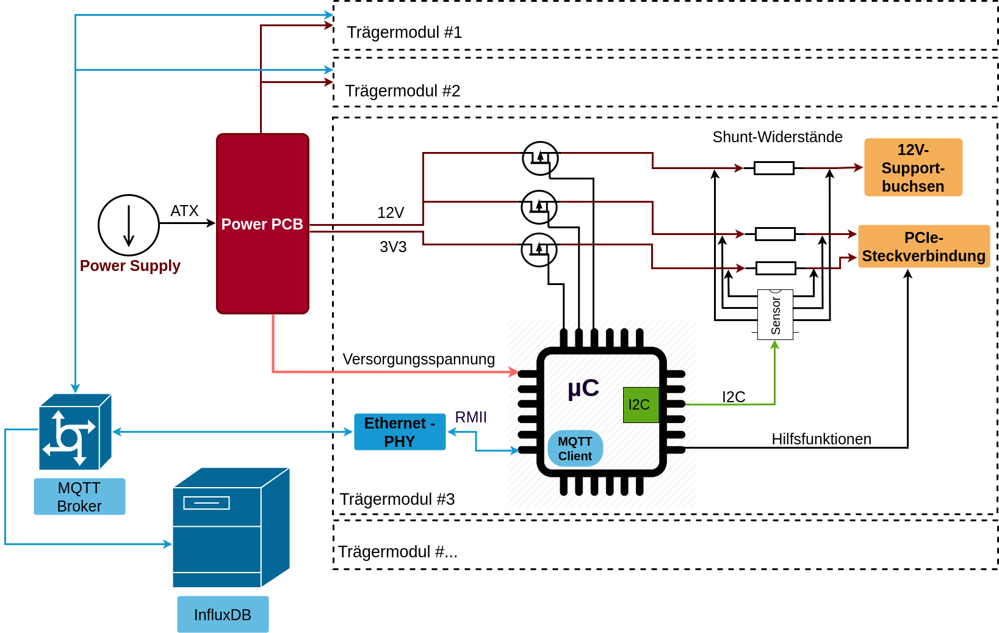

# NAA-Measurment-Carrier-System

This project includes the hardware and software solution of a carrier system for network attached accelerators (NAA). It is intended to be placed in a server rack and replace the common CPU-based carrier systems for hardware accelerators. It was developed as part of a master thesis at the Fraunhofer Institute HHI in the ESG group.

## Overview

This project focuses on making the use of NAAs more energy efficient and to measure their application-specific power consumption during operation. For this purpose, a system was designed and realized which consists of several PCBs and the implementation of microcontroller software. The complete project is explained in detail in the written version of the [master thesis](Doku/MasterThesis_NAA_Mess_TrägerSystem_PaulMamatis.pdf)
. A further [documentation of the source code](Doku/doxygen_out/html/index.html) has been created with the help of Doxygen.

## Code 
The Code section conatains the C-Code for the microcontroller, the python code forthe measurement evaluation and some bash-scripts for implmenting a remote. 

## PCB
contains the KiCad files for the pcb designs of the carrier modul.

## Usage

This repository is for application purposes and represents my latest work. 
